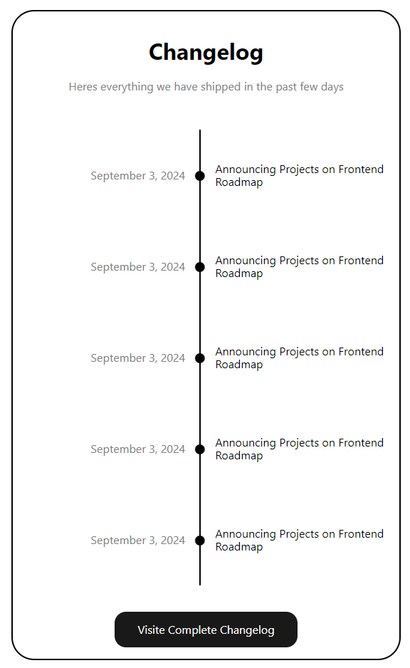
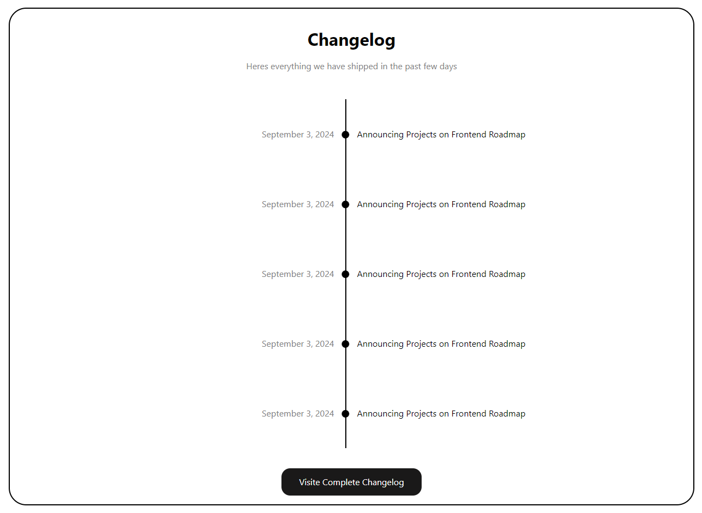

# Changelog Component

A simple HTML changelog component.

## How to use

1. Clone the repository
2. Open the `index.html` file in a web browser

## Screenshots

## Project Page

https://roadmap.sh/projects/changelog-component
